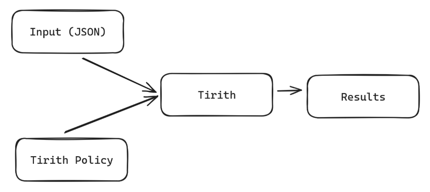
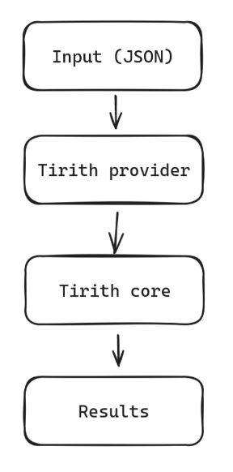
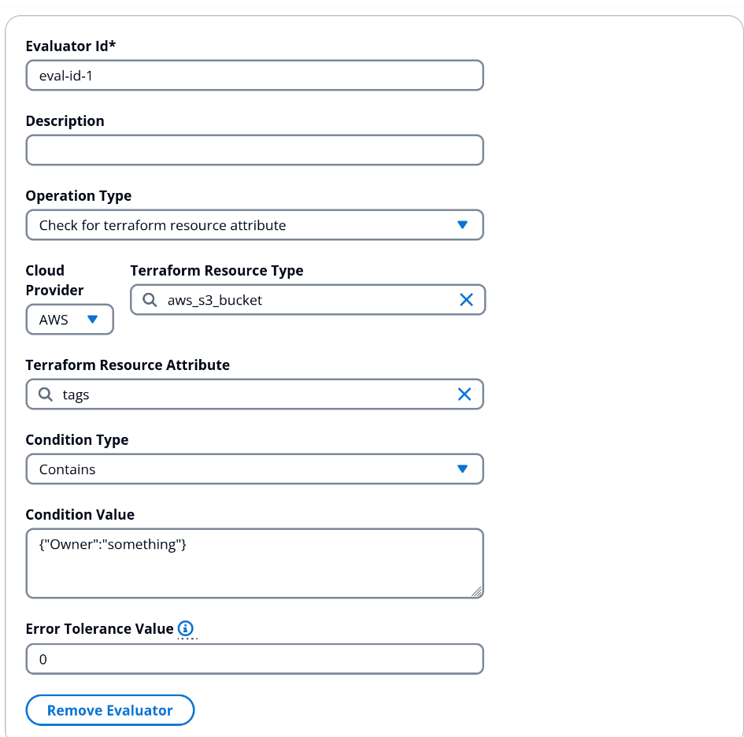

# Tirith Workshop

July 8th 2024

Time: 1 - 2 hours

## Outline

-   Introduction to Tirith
-   Creating your first policy
-   Use Case: Guardrailing Terraform deployment
-   Use Case: Guardrailing cloud cost
-   Tirith on StackGuardian platform

Purpose:
-   Be able to understand and advocate Tirith
-   Be able to contribute to Tirith Roadmap

## Introduction to Tirith

Time: 15 minutes

In this section, you will learn about:

-   What Tirith is about

-   Why are we doing Tirith

-   Philosophy of Tirith

### What is Tirith?

-   Tirith scans declarative Infrastructure as Code (IaC) configurations like Terraform against policies defined using JSON.
-   Tirith is a **declarative** policy engine, not imperative.
-   Currently, the focus is more to be a **proactive** policy evaluator than **reactive**.
-   It is a CLI-based program, but can also be used as a Python library

### Why are we doing Tirith?
-   Writing Policy as Code is not easy and requires a steep learning curve
-   Expensive to maintain policies in IaC Logic
    -   (We can write very basic validations inside Terraform)
-   Even with current engines there are still manual approvals needed
    ending up in ticketing systems
-   Hardcoded IaC, you need several code bases
-   Policies are not going beyond resources configuration! Why not going 
    to cost or even CI/CD definitions?

[TODO: Add more explanations and Terraform examples]{.mark}

Imagine that in an organisation, you have an IaC codebase and you want
to ensure that every **aws_lambda_function** inside the codebase has
memory set to 128 or even lower than 128.

### Philosophy of Tirith

To run Tirith, the user has to provide two files: the input, and the
policy. Tirith will then evaluate the policy against the input, and then
it will produce a result, either Pass, Fail, or Skip.



Tirith is heavily inspired by the architecture of Terraform providers.
In which the provider provides an abstraction layer for the user so that
they don't have to understand how to get the data that we are interested
in evaluating.

Internally, more or less, Tirith works like this:



Example of a Tirith policy to make sure that:

-   AWS VPC instance_tenancy is \"default\"

-   EC2 instance cannot be destroyed
```json
{
  "meta": {
    "required_provider": "stackguardian/terraform_plan",
    "version": "v1"
  },
  "evaluators": [
    {
      "id": "check_ec2_tenancy",
      "provider_args": {
        "operation_type": "attribute",
        "terraform_resource_type": "aws_vpc",
        "terraform_resource_attribute": "instance_tenancy"
      },
      "condition": {
        "type": "Equals",
        "value": "default"
      }
    },
    {
      "id": "destroy_ec2",
      "provider_args": {
        "operation_type": "action",
        "terraform_resource_type": "aws_instance"
      },
      "condition": {
        "type": "ContainedIn",
        "value": ["destroy"]
      }
    }
  ],
  "eval_expression": "check_ec2_tenancy && !destroy_ec2"
}

```

1.  When input and policy file goes into Tirith, Tirith will use the
    provider that the user has specified inside the policy's meta
    definition

2.  Based on that, it will go to each evaluator, ask the provider to
    extract the input based on the **provider_args** key.

3.  The provider will return the result

4.  It will then evaluated against the condition that is specified in
    the evaluator and results in Pass, Fail, or Skip

5.  When all of the evaluators already got the result, the final result
    of the evaluation will be decided by the expression inside the
    **eval_expression** key

## Creating your first policy: evaluating against a JSON file

Time: 20 minutes

In this section, we will take a look on how we can use Tirith to
guardrail a JSON input.

You will learn about:

-   Tirith CLI command to evaluate a policy against an input

-   Tirith JSON provider

-   Tirith error tolerance

### Preparation

Before doing this exercise, create two files, one for input.json one for
policy.json.

**input.json**

```json
{
  "pathName": "/stackguardian/wfgrps/test",
  "verb": "POST",
  "meta": {
    "epoch": 1718860398,
    "User-Agent": {
        "name": "User-Agent",
        "value": "PostmanRuntime/7.26.8"
    }
  }
}
```

**policy.json**

```json
{
    "meta": {
        "version": "v1",
        "required_provider": "stackguardian/json"
    },
    "evaluators": [
        {
            "id": "can_post",
            "provider_args": {
                "operation_type": "get_value",
                "key_path": "verb"
            },
            "condition": {
                "type": "Equals",
                "value": "POST"
            }
        },
        {
            "id": "wfgrps_path",
            "provider_args": {
                "operation_type": "get_value",
                "key_path": "path"
            },
            "condition": {
                "type": "RegexMatch",
                "value": "/stackguardian/wfgrps/test.*"
            }
        },
        {
            "id": "epoch_less_than_8th_july_2024",
            "provider_args": {
                "operation_type": "get_value",
                "key_path": "meta.epoch"
            },
            "condition": {
                "type": "LessThan",
                "value": 1720415598
            }
        }
    ],
    "eval_expression": "can_post && wfgrps_path && epoch_less_than_8th_july_2024"
}
```

### Evaluating the policy against the input

To evaluate the policy against the input, run the following command:

```sh
tirith -input-path input.json -policy-path policy.json
```

Explanation:

-   **tirith**:

    -   This is the command to run the Tirith program, which is part of
         the StackGuardian Policy Framework.

-   **-input-path input.json**:

    -   The -input-path option specifies the path to the input file.

    -   input.json is the file that contains the input data to be
         scanned by Tirith.

-   **-policy-path policy.json**:

    -   The -policy-path option specifies the path to the policy file.

    -   policy.json is the file that contains the policies (rules)
         defined in Tirith\'s policy as code.

It should print:
```
Check: can_post
  PASSED
  Results:
	1. PASSED: POST is equal to POST

Check: wfgrps_path
  PASSED
  Results:
	1. PASSED: /stackguardian/wfgrps/test matches regex pattern /stackguardian/wfgrps/test.*

Check: epoch_less_than_8th_july_2024
  PASSED
  Results:
	1. PASSED: 1718860398 is less than 1720415598

Passed: 3 Failed: 0 Skipped: 0

Final expression used:
-> can_post && wfgrps_path && epoch_less_than_8th_july_2024
✔ Passed final evaluator
```


### Error tolerance

What if sometimes one or more keys inside the input file are not found?
Let's try to delete the **verb** key inside the **input.json** and see
what happens when we try to run the evaluation again using the same
command above.

It should fail the evaluation.

What if we, as a user, want the evaluator to "skips" itself (don't
include the result to the final evaluator) when a particular key is not
found?

This is when **error tolerance** can be helpful.

A provider can raise an error and the error itself has a **severity**
value. (see Appendix). In this case the JSON provider raises an error of
severity value 2 when the `get_value` operation can't find the JSON
path inside the input.

By setting the **error_tolerance** value to 2 or more inside the
**condition** key in the evaluator, it will mark the evaluator as
Skipped instead of Failed.

## Use Case: Guardrailing Terraform deployment

Time: 10 minutes

In this section, we will take a look on how we can use Tirith to
guardrail a Terraform deployment to make sure that S3 is private.

You will learn about:

-   A little bit about terraform plan file

-   `stackguardian/terraform_plan` provider (real capability of a
     provider)

### Terraform plan file

Before we run "terraform apply", ideally we'll run "terraform plan"
first to see what are the changes that will be made when we do
"terraform apply". So it's like "dry-run" only to see whether the
changes are aligned to what we expect or not.

In essence, we can generate a terraform plan file by using the following
command:

```sh
terraform plan -out plan.bin && terraform show -json plan.bin | jq > plan.json
```


Explanation:

-   terraform plan -out plan.bin:

    -   Creates an execution plan and saves it to plan.bin.

-   &&:

    -   Ensures the next command runs only if the previous command is
        > successful.

-   terraform show -json plan.bin:

    -   Converts the execution plan in plan.bin to JSON format.

-   \| jq:

    -   Processes and pretty-prints the JSON output.

-   \> plan.json:

    -   Redirects the output to a file named plan.json.

The generated plan.json file contains information about what plan will
be executed when "terraform apply" is run. It's quite a big file.
Detailed information about what it contains can be found here:
[https://developer.hashicorp.com/terraform/internals/json-format#plan-representation](https://developer.hashicorp.com/terraform/internals/json-format#plan-representation)

In Tirith's `stackguardian/terraform_plan` provider, we will use the final
plan.json file as the input.

### Tirith `stackguardian/terraform_plan` provider

`stackguardian/terraform_plan` provider provides abstraction over the terraform plan JSON output file. The available operation_types and its arguments are available on the Appendix section.

Here we will create a policy to make sure that all `aws_s3_bucket` are
referenced by `aws_s3_bucket_intelligent_tiering_configuration`.

**policy.json**

```json
{
  "meta": {
    "required_provider": "stackguardian/terraform_plan",
    "version": "v1"
  },
  "evaluators": [
    {
      "id": "s3HasLifeCycleIntelligentTiering",
      "description": "Make sure all aws_s3_bucket are referenced by aws_s3_bucket_intelligent_tiering_configuration",
      "provider_args": {
        "operation_type": "direct_references",
        "terraform_resource_type": "aws_s3_bucket",
        "referenced_by": "aws_s3_bucket_intelligent_tiering_configuration"
      },
      "condition": {
        "type": "Equals",
        "value": true,
        "error_tolerance": 1
      }
    }
  ],
  "eval_expression": "s3HasLifeCycleIntelligentTiering"
}
```

Explanation:

-   It uses "direct_references" operation_type which will figure out
     whether all instances of resource type that's defined on
     "terraform_resource_type" are referenced by the one that's defined
     in "referenced_by".

    -   In this case, we are looking whether all **aws_s3_bucket**
         instances are referenced by
         **aws_s3_bucket_intelligent_tiering_configuration**

    -   The result of this operation type is boolean

**input.json: Available on the workshop repo**

Let's try to run the evaluation!

## Use Case: Guardrailing cloud cost

Time: 10 minutes

In this section, we will take a look on how we can use Tirith to make
sure that aws_s3_instance usage per month is lower than 300 USD.

You will learn about:

-   A little bit about the infracost json file

-   Tirith Infracost provider

### Infracost JSON file

Infracost is a tool that can predict cost from a Terraform
configuration. This tool has an option to get the JSON output by using
the ... command. We can then use the JSON file resulting from the
infracost tool as an input for stackguardian/infracost provider.

The structure of the JSON file can be found here:
[https://www.infracost.io/docs/features/json_output_format/](https://www.infracost.io/docs/features/json_output_format/)

### `stackguardian/infracost` provider

`stackguardian/infracost` provider provides an abstraction over the
Infracost JSON output. By using this provider, we get the functionality
to extract the information about total monthly cost and total hourly
cost from the JSON output without writing a single code. More details
are available in the appendix section.

Let\'s use the infracost provider to make sure that aws S3 usages per
month doesn\'t exceed 30 USD.

Here is the policy for doing that:
```json
{
    "meta": {
        "required_provider": "stackguardian/infracost",
        "version": "v1"
    },
    "evaluators": [
        {
            "id": "monthly_cost_below_30",
            "description": "monthly_cost_below_30",
            "provider_args": {
                "operation_type": "total_monthly_cost",
                "resource_type": [
                    "*"
                ]
            }
            "condition": {
                "type": "LessThanEqualTo",
                "value": 30
            },
        }
    ],
    "eval_expression": "monthly_cost_below_30"
}
```
Explanation:
- It uses `total_monthly_cost` operation type, which has a required paarameter `resource_type` that has type list of string
- We define the `resource_type` as `["*"]`, which means it will take all of the resources inside the JSON file and sum up the cost
- After the result is obtained, it will be evaluated against the condition that is defined in the `condition` key, which is `LessThanEqualTo` 30

**input.json: Available on the input directory**
## Tirith on StackGuardian platform

Time: 10 minutes

StackGuardian Orchestration Platform supports Tirith on its workflow
engine. For instance, a user can make a policy to make sure that monthly
cost usage is lower than 100 USD, the policy then applied into a
workflow, then when the user runs that workflow, it will evaluate first
whether the policy is passing or failing, if it passes it will continue
to run the workflow, otherwise it will not run the workflow

You will learn about:

-   Creating a Tirith policy with Terraform Plan provider

-   Applying that policy into a workflow

### Creating a Tirith policy to Guardrail aws_eks_node_group's tags

1.  Go into the **Policies** section in the Orchestrator

2.  Click on **Create Policy**

3.  Fill the resource name with a descriptive name

4.  Click on Settings \> Rules \> Add New Policy Rule

5.  Fill the values like the image below

{width="6.353089457567804in"
height="4.802935258092738in"}

Explanation

-   We are using the "attribute" operation type, which will get the
    > "attribute" of the instances of resource type that's defined in
    > the "resource_type"

    -   In this case, we are getting the values of the attribute "tags"
        > in the "aws_eks_node_group" resource type

-   In the condition type, we are using Contains, which will make sure
    > that the result of the provider contains the value defined in the
    > "Condition value"

    -   In this case, we are making sure that the output of the provider
        > contains the string '{"costcenter....'

### Creating a workflow

Let\'s try a dummy workflow that creates EKS node group by using a
template available in the marketplace:

1.  Create a workflow

2.  Select the aws eks node group template

3.  Fill the fields

### Applying the policy into a workflow

Running the workflow

## Appendix

### Available Tirith Condition Types

-   **ContainedIn**: Checks if the given value is contained within a
    > specified list or collection.

-   **Contains**: Checks if a specified list or collection contains the
    > given value.

-   **Equals**: Checks if the given value is equal to a specified value.

-   **GreaterThanEqualTo**: Checks if the given value is greater than or
    > equal to a specified value.

-   **GreaterThan**: Checks if the given value is greater than a
    > specified value.

-   **IsEmpty**: Checks if the given value, list, or collection is
    > empty.

-   **IsNotEmpty**: Checks if the given value, list, or collection is
    > not empty.

-   **LessThanEqualTo**: Checks if the given value is less than or equal
    > to a specified value.

-   **LessThan**: Checks if the given value is less than a specified
    > value.

-   **RegexMatch**: Checks if the given value matches a specified
    > regular expression pattern.

-   **NotEquals**: Checks if the given value is not equal to a specified
    > value.

-   **NotContainedIn**: Checks if the given value is not contained
    > within a specified list or collection.

-   **NotContains**: Checks if a specified list or collection does not
    > contain the given value.

### Available Tirith Providers and its operation types

**stackguardian/terraform_plan:**

1.  **attribute**:

    -   **Description**: Get the value of a specific attribute of a
         resource.

    -   **Needed Args**:

        -   **terraform_resource_type**: The terraform resource type to
             get the attribute (tools:
             search_terraform_resource_types_tool).

        -   **terraform_resource_attribute**: The attribute to get the
             value (tools: search_terraform_attributes_tool).

    -   **Error Values**:

        -   **1**: When a resource is not found.

        -   **2**: When an attribute of a resource is not found.

        -   **99**: Generic error for unsupported operations or invalid
             inputs.

2.  **action**:

    -   **Description**: Get actions performed on a resource.

    -   **Needed Args**:

        -   **terraform_resource_type**: The terraform resource type to
             get the actions (tools:
             search_terraform_resource_types_tool).

    -   **Error Values**:

        -   **1**: When a resource is not found.

        -   **99**: Generic error for unsupported operations or invalid
             inputs.

3.  **count**:

    -   **Description**: Get count of a particular resource.

    -   **Needed Args**:

        -   **terraform_resource_type**: The terraform resource type to
             get the count (tools:
             search_terraform_resource_types_tool).

    -   **Error Values**:

        -   **99**: Generic error for unsupported operations or invalid
             inputs.

4.  **direct_dependencies**:

    -   **Description**: Get direct dependencies of a resource.

    -   **Needed Args**:

        -   **terraform_resource_type**: The terraform resource type to
             get the direct dependencies (tools:
             search_terraform_resource_types_tool).

    -   **Error Values**:

        -   **99**: Generic error for unsupported operations or invalid
             inputs.

5.  **direct_references**:

    -   **Description**: Get direct references to or from a resource.

    -   **Needed Args**:

        -   **terraform_resource_type**: The terraform resource type to
             get the direct references (tools:
             search_terraform_resource_types_tool).

        -   **referenced_by**: The resource type that references the
             specified resource type (tools:
             search_terraform_resource_types_tool).

        -   **references_to**: The resource type that the specified
             resource type references (tools:
             search_terraform_resource_types_tool).

    -   **Error Values**:

        -   **1**: When a resource is not found.

        -   **99**: Generic error for unsupported operations or invalid
             inputs.

6.  **terraform_version**:

    -   **Description**: Get the Terraform version from the plan.

    -   **Needed Args**: None.

    -   **Error Values**:

        -   **99**: Generic error for unsupported operations or invalid
             inputs.

7.  **provider_config**:

    -   **Description**: Get the provider configuration from the plan.

    -   **Needed Args**:

        -   **terraform_provider_full_name**: The full name of the
             Terraform provider (tools:
             search_terraform_providers_tool).

        -   **attribute**: The attribute of the provider configuration
             to retrieve. Supported values: \'version_constraint\',
             \'region\' (tools: search_provider_attributes_tool).

    -   **Error Values**:

        -   **1**: When a resource is not found.

        -   **2**: When an attribute of a resource is not found.

        -   **99**: Generic error for unsupported operations or invalid
             inputs.

**stackguardian/infracost:**

1.  **total_monthly_cost**:

    -   **Description**: Get the total monthly cost of all resources or
         specific resources.

    -   **Needed Args**:

        -   **resource_type**: The type of the resource to calculate the
             cost for (tools: search_resource_types_tool).

        -   **operation_type**: The type of cost operation to perform,
             e.g., \'total_monthly_cost\' (tools:
             search_cost_operations_tool).

    -   **Error Values**:

        -   **1**: When a resource is not found.

        -   **99**: Generic error for unsupported operations or invalid
             inputs.

2.  **total_hourly_cost**:

    -   **Description**: Get the total hourly cost of all resources or
         specific resources.

    -   **Needed Args**:

        -   **resource_type**: The type of the resource to calculate the
             cost for (tools: search_resource_types_tool).

        -   **operation_type**: The type of cost operation to perform,
             e.g., \'total_hourly_cost\' (tools:
             search_cost_operations_tool).

    -   **Error Values**:

        -   **1**: When a resource is not found.

        -   **99**: Generic error for unsupported operations or invalid
             inputs.

**stackguardian/kubernetes:**

1.  **attribute**:

    -   **Description**: Get the value of a specific attribute of a
         Kubernetes resource.

    -   **Needed Args**:

        -   **kubernetes_kind**: The Kubernetes resource kind to get the
             attribute from (tools:
             search_kubernetes_resource_kinds_tool).

        -   **attribute_path**: The path to the attribute in the
             Kubernetes resource (tools:
             search_kubernetes_attributes_tool).

    -   **Error Values**:

        -   **1**: When a resource is not found.

        -   **99**: Generic error for unsupported operations or invalid
             inputs.

**stackguardian/json:**

1.  **get_value**:

    -   **Description**: Get the value from a dictionary based on the
         specified key path.

    -   **Needed Args**:

        -   **key_path**: The path to the key in the input dictionary,
             separated by ., can also have \* (wildcard). If \* is
             provided, the returned value will be a list (tools:
             search_key_paths_tool).

    -   **Error Values**:

        -   **2**: When the key path is not found.

        -   **99**: Generic error for unsupported operations or invalid
             inputs.
